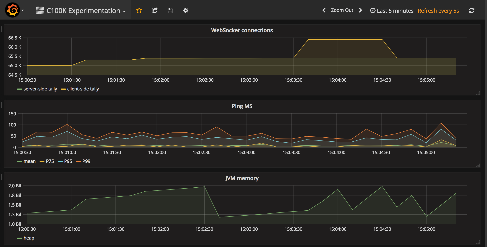
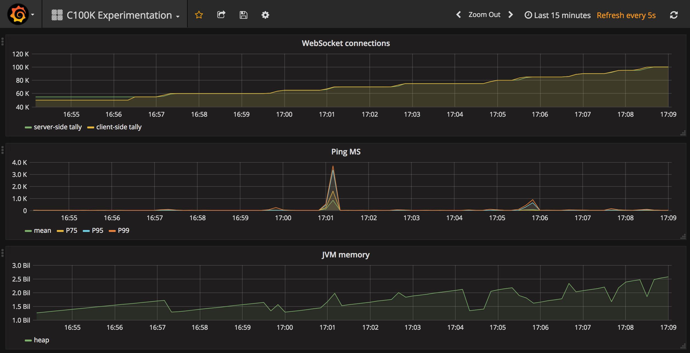
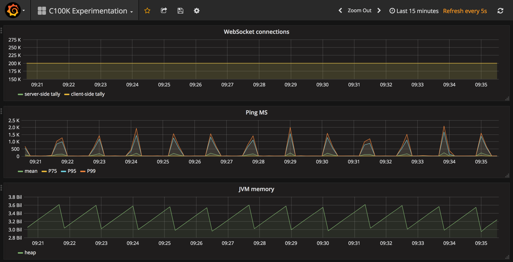

play-c100k-server
=================

This simple repo tests the upper limit on concurrent connections
served by a [Play Framework](https://www.playframework.com/) server.
There are two main questions to answer for any concurrency test:

1. How many simultaneous connections can be maintained?
2. How quickly can new connections be acquired?

We use [WebSockets](https://developer.mozilla.org/en-US/docs/Web/API/WebSockets_API) for testing
because they allow us to keep sockets open for an arbitrary length of time,
and they are a part of HTTP,
which we like and leverage extensively across our infrastructure.

Setup
-----

### Setting up the server

Build it.

    # output: target/universal/play-c100k-server-0.1.1-PLAY26.tgz
    ./bin/activator universal:packageZipTarball

A bigger server than your MacBook is needed to get impressive numbers,
so upload to an AWS instance or some such.

    scp target/universal/play-c100k-server-0.1.1-PLAY26.tgz c100k_server:
    ssh c100k_server
    tar xf play-c100k-server-0.1.1-PLAY26.tgz

More stuff to install:

* Java 8
* Telegraf to collect metrics from the server and output to InfluxDB
* InfluxDB for aggregating metrics
* Grafana for viewing metrics

Start the server on port 9000

    screen
    export JAVA_HOME=/path/to/java8
    ./play-c100k-server-0.1.1-PLAY26/bin/play-c100k-server

### Setting up the client

Build it.

    # output: client/target/universal/play-c100k-client-0.1.1-PLAY26.tgz
    ./bin/activator 'project client' universal:packageZipTarball

Upload to all your client servers.
I've been able to get 20k clients per instance.

    scp client/target/universal/play-c100k-client-0.1.1-PLAY26.tgz c100k_client:
    ssh c100k_client
    tar xf play-c100k-client-0.1.1-PLAY26.tgz

Install:

* Java 8
* Telegraf

Start the client

    screen
    export JAVA_HOME=/path/to/java8
    ./play-c100k-client-0.1.1-PLAY26/bin/play-c100k-client
    CTRL-a CTRL-d

Initiate some client connections

    curl localhost:9000/clients --data 'ws=ws://c100k_server:9000/ws/echo&count=5'

This creates 5 WebSocketClient instances connected to the c100k_server echo WebSocket.
All clients send a ping every 30 seconds, and aggregate the latency.
They should remain connected indefinitely, due to the pings.

Experiment 1: Testing with long polling
---------------------------------------

An initial version of this test used an old school technique known as long polling.
My thinking was that I could use Apache benchmark as the clients and save myself some programming time.
The results were underwhelming.
I believe this is because the rate of connection acquisition is limited,
so if your clients are constantly disconnecting and reconnecting,
you're going to have a hard time reaching a high count of concurrent connections.

Experiment 2: Pinging a WebSocket echo server
---------------------------------------------

In this simple experiment,
we're trying to get as many clients connected simultaneously as possible.
The server accepts WebSocket connections,
and echos back any text sent back to the client.
The client connects and sends a ping message every 30 seconds.

The server in this experiment was an AWS c3.2xlarge.
The clients were 10 AWS c3.large instances.
They all used the java-1.8.0-openjdk-1.8.0.101-3.b13.24.amzn1.x86_64 JVM.

All the following tests require adding connections at a controlled rate.
Much larger than 10k simultaneous establishments,
and we start to see failed connection attempts.

Predictably, once the server reached the 65k max file descriptors limit,
it stopped accepting new connections.
This can be seen clearly in this graph as the count of client connections increases beyond the limit,
while the server connection tally remains the same.
After 60s the clients realize they are not connected and remove themselves from the count.

After this point, I set the max file descriptors to 500k.

Here I was able to reach 100k concurrent connections using 5 client instances.

With each client instance maxing out at about 20k connections,
I was able to reach 200k connections using 10 client instances.
The server is also starting to look pretty busy in terms of CPU and memory.
I'd like to re-run this test increasing the memory of the server.

Leaving the server and clients running overnight,
all connections have remained active,
and ping times are really good,
discounting stop-the-world garbage collection.

Experiment 3: Rate of connection acquisition
--------------------------------------------

Test how quickly connections can be established.

TODO

Experiment 4: Rerun tests using Netty and Play 2.5
--------------------------------------------------

What changes when we run tests 2 and 3 using Play 2.5 and/or Netty.

TODO

Experiment 5: 1M simultaneous connections
-----------------------------------------

By hook or by crook is it possible to reach 1 million connections with a Play application.

TODO
